# 🤖 Agentic RAG Workflow

A production-ready, high-performance Retrieval-Augmented Generation (RAG) system powered by a **4-Agent LangGraph workflow**. This system features intelligent query rewriting, agentic routing, and self-correcting validation to deliver grounded, high-fidelity answers.

---

## 🎯 Project Overview

This system goes beyond basic RAG by treating document interaction as a conversation between specialized AI agents. It is designed for robustness, transparency, and visually stunning user engagement.

### 🌟 Key Innovations
- **🧠 4-Agent "Brain"**: Specialized agents for Retrieval, Generation, Validation, and Final Formatting.
- **🖼️ Native Image Support**: Direct ingestion of PNG/JPG files via **DeepSeek-OCR**.
- **⚙️ Agentic Trace**: Real-time visibility into the agent's thinking process (Routing, Internal Queries, Retrieved Chunks).
- **🔴 Ingestion Control**: Interrupt long-running OCR tasks with "Cancel Ingestion".

---

## 🏗️ Architecture

### High-Level Flow

```mermaid
graph TD
    A["PDF/Image Upload"] --> B{"File Type?"}
    B -- "PDF" --> C["PyMuPDF (Fast Extraction)"]
    B -- "Image" --> D["DeepSeek-OCR (Replicate)"]
    C --> E["DeepSeek-OCR (if scanned)"]
    D --> F["Semantic Chunking"]
    E --> F
    F --> G["ChromaDB Vector Index"]

    User["User query"] --> H["Agentic Workflow"]
    H --> I["🧠 Smart Retriever"]
    I --> J{"Intent?"}
    J -- "Retrieval" --> K["Generator Agent"]
    K --> L["Validator Agent"]
    L -- "Valid" --> M["Final Response Agent"]
    L -- "Invalid" --> K["Self-Correction Loop"]
    J -- "Conversational" --> M
    M --> Output["Final Answer + Agentic Trace"]
```


### The 4-Agent Team
1. **🔍 Smart Retriever**: Handles query rewriting (for better context alignment) and routes between conversational or retrieval paths.
2. **✍️ Generator**: Synthesizes grounded answers using the retrieved document context.
3. **⚖️ Validator**: Audits the generated response for hallucinations and ensuring it is strictly grounded in the provided context.
4. **🏁 Final Response**: Orchestrates the output, attaching the **Agentic Trace** and formatting metadata without LLM lag.

---

## 🛠️ Technology Stack

| Component | Technology |
|-----------|-----------|
| **Workflow** | LangGraph (State-Driven) |
| **LLM** | OpenAI `gpt-5-nano` |
| **Embeddings** | OpenAI `text-embedding-3-small` |
| **Vector Store** | ChromaDB (Persistent) |
| **PDF Engine** | PyMuPDF (Fitz) - *Enterprise Grade* |
| **OCR Engine** | DeepSeek-OCR (via Replicate) |
| **UI Framework** | Streamlit (Custom Premium Dark Theme) |
| **Package Management** | `uv` |

---

## 📦 Quick Start

### 1. Prerequisites
- Python 3.12+
- [uv](https://github.com/astral-sh/uv) package manager
- OpenAI API Key
- Replicate API Token

### 2. Installation
```bash
# Clone and enter
git clone <repository-url>
cd rag-agentic-system

# Install dependencies
uv sync
```

### 3. Configuration
Create a `.env` file in the root:
```env
OPENAI_API_KEY=sk-...
REPLICATE_API_TOKEN=r8_...
LLM_MODEL=gpt-5-nano
LOG_LEVEL=INFO
```

### 4. Run the System
```bash
# Launch the Premium UI
uv run streamlit run streamlit_app/app.py
```

---

## 🚀 Key Features Walkthrough

### 🔎 Agentic Trace
Tired of "Black Box" AI? Expand the **🧠 Agentic Trace** section in any response to see:
- The **Intent** (Retrieval vs. Conversational).
- The **Internal Query** the agent used for searching.
- The **Exact Snippets** retrieved from your documents.

### 🖼️ Document Center
Located in the sidebar, the Document Center allows you to:
- Monitor **Chunk Counts** in your vector index.
- Upload **PDFs, PNG, and JPGs**.
- **Cancel Ingestion** if you accidentally upload a massive file.
- **Wipe Vector Store** for a fresh start.

### 📥 Export Trace
Every conversation can be exported as a professional Markdown log, including all internal agent activities and retrieved summaries.

---

### 📄 Sample Data & Transcripts
To help you get started, I've included:
- **`data/sample/example_chat_interaction.md`**: A full transcript of the 4-agent workflow in action, including Agentic Traces.
- **`data/sample/scanned_ml_doc.pdf`**: A perfect sample for testing both text extraction and OCR.

---

## 📁 System Structure
```text
├── src/
│   ├── agents/      # Smart Retriever, Generator, Validator, FinalResponse
│   ├── ingestion/   # PyMuPDF Loader, DeepSeek-OCR, Semantic Chunking
│   ├── workflow/    # LangGraph definition & shared state
│   └── vectorstore/ # ChromaDB persistence
├── streamlit_app/   # Premium UI with st.status & custom CSS
├── data/            # Sample & Uploaded data
└── README.md
```

Built with ❤️ for the assessment.
